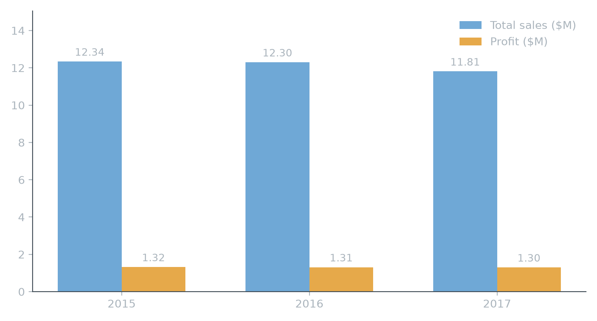

# DataCo Supply Chain Analysis

Exploratory analysis of the DataCo supply chain dataset: company growth, sales
correlation, product/region breakdowns, regional deep-dives, fraud and
late-delivery exposure, and an early-predictor / discount-experiment design.

See `presentation/charts/` for the full set of story charts backing the
narrative in the notebooks (`0.1` through `5_discount_experiment_design.ipynb`).
